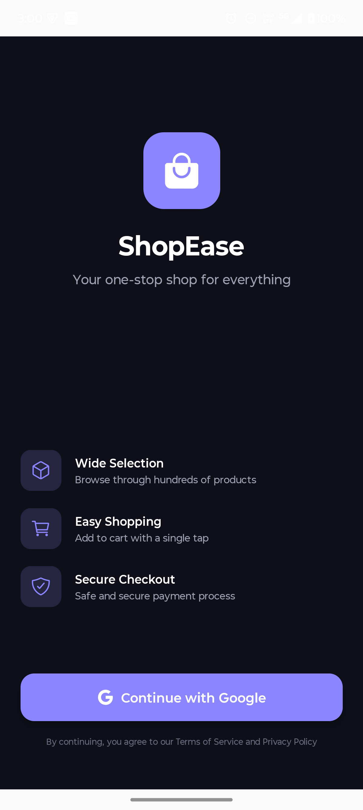
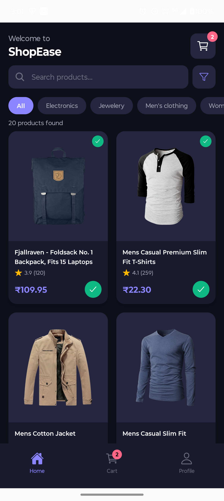
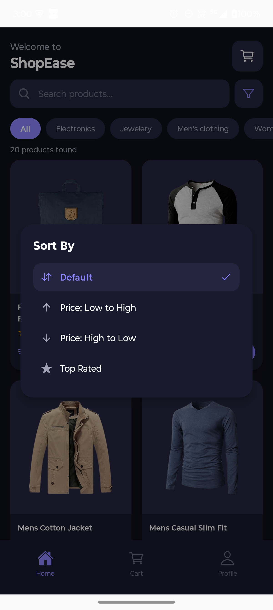
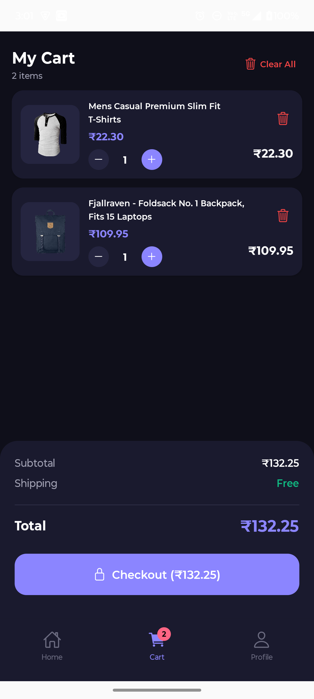
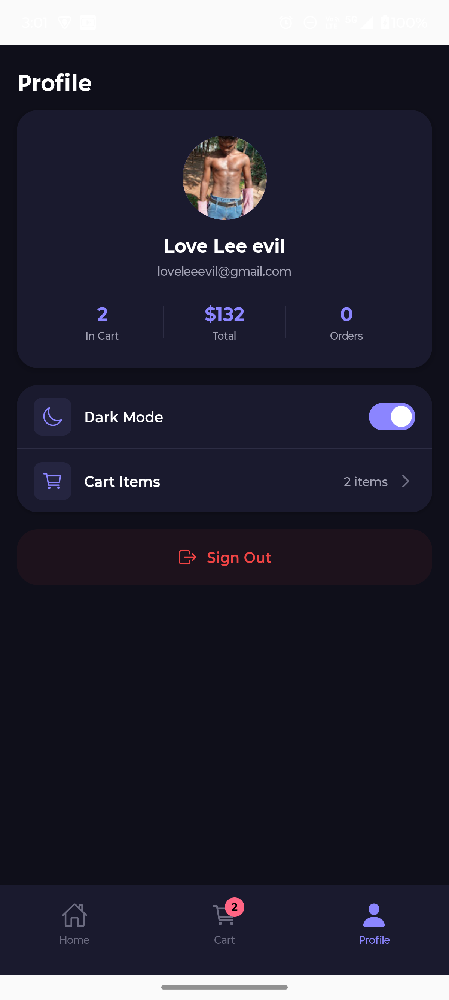
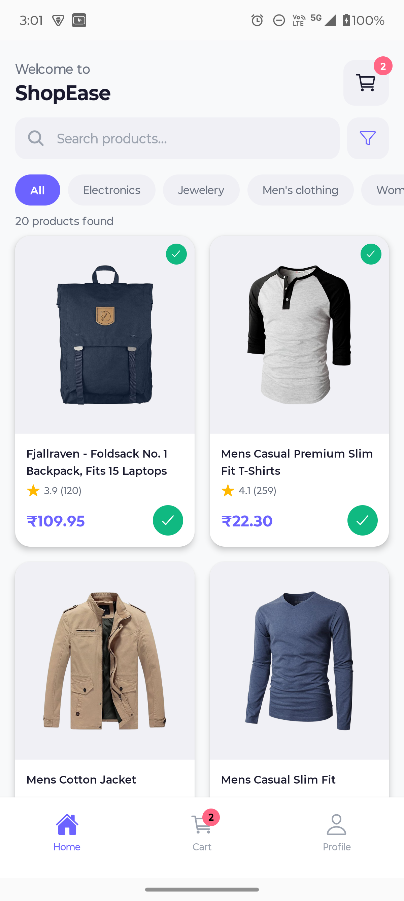
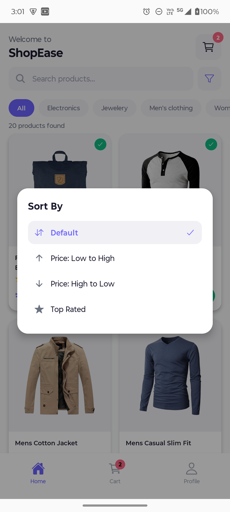
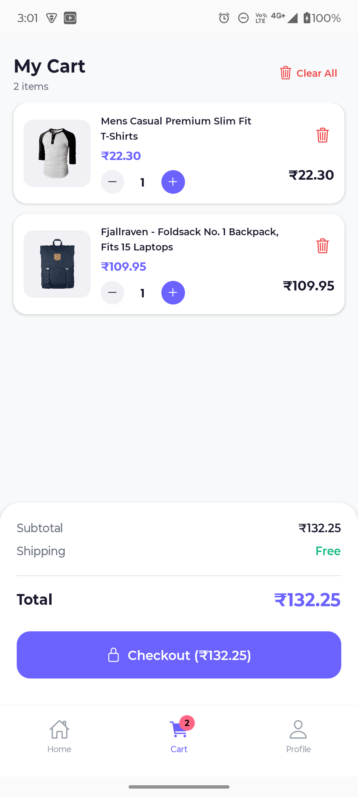
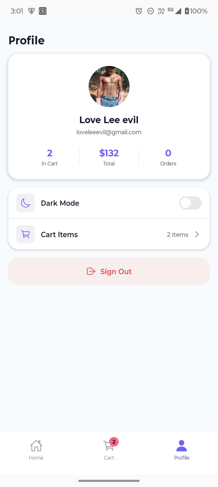

# ShopEase - Shopping App

Hi! sadaf and the technical hiring team this the ecommerce application which was given to me for process of interview below is the complete technical description of the project

# Here the figma link i reffeed for this project 

https://www.figma.com/community/file/1245385141730558466/laza-ecommerce-mobile-app-ui-kit


## What this app does

- You can browse products and search for what you want
- Filter products by category (electronics, jewelery, etc.)
- Sort products by price or rating
- Add products to cart and manage quantities
- Dark mode is also there (I am proud of this one)
- Google Sign-In for login
- Works offline too! If internet is gone, it shows cached data

## Screenshots

### Dark Mode

| Login Screen | Google Sign-In | Home Screen |
|:---:|:---:|:---:|
|  |  |  |

| Sort Products | Cart Screen | Profile Screen |
|:---:|:---:|:---:|
|  |  |  |

### Light Mode

| Home Screen | Sort Products | Cart Screen |
|:---:|:---:|:---:|
|  |  |  |

| Profile Screen | Google Sign-In |
|:---:|:---:|
|  |  |

## Tech Stack

I used the following technologies to build this app:

- React Native (v0.84.0)
- TypeScript
- React Navigation (for moving between screens)
- Axios (for API calls)
- AsyncStorage (for saving data locally)
- Context API (for state management, I didn't use Redux that would be complex for a small application)
- Lottie (for animations)
- React Native Vector Icons (for icons)
- Google Sign-In (for authentication)

## API Used

I used the [Fake Store API](https://fakestoreapi.com) to get product data. It is a free API so you don't need any API key.

## Folder Structure

```
ShopEase/
├── App.tsx
├── src/
│   ├── components/       (reusable UI components)
│   ├── screens/          (all the screens)
│   ├── context/          (AuthContext, CartContext, ThemeContext)
│   ├── services/         (API calls and caching)
│   ├── hooks/            (custom hooks)
│   ├── constants/        (theme colors and spacing)
│   └── types/            (TypeScript types)
```

## How to run this project

Make sure you have Node.js, React Native CLI, and Android Studio installed.

```bash
# Step 1: Clone the repo
git clone  https://github.com/workbysurajmourya-rgb/shopease

# Step 2: Go into the project folder
cd ShopEase

# Step 3: Install dependencies
npm install

# Step 4: Start metro bundler
npm start

# Step 5: Run on android (open another terminal)
npm run android
```

If you face any gradle issues, try this:

```bash
cd android
./gradlew clean
cd ..
npm run android
```
